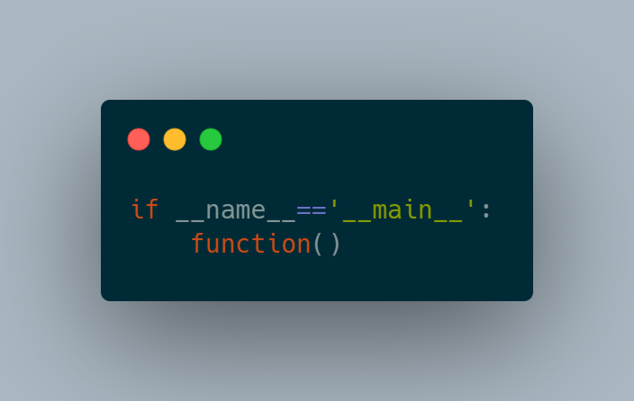

# Exploring if `__name__ == "__main__":`

This repository is all I did trying to undersand the behaviour of the __name__ variable.

There are three files:
* simiel.py [The main file]
* simiel2
* simiel3

### 1. simiel.py
Running simiel.py will import the two remaining python files
The function and print statement from simiel2 will be fully run
the function from simiel3 will be available to be called but not called because of the "if-statement"
all remaining code in simiel.py will be run as well.

### 2. simiel2.py
Running simiel2.py will run its function and print statement

### 3. simiel3.py
Running simiel3.py will run it's function.
A sweet hello from my little girl, Naa Atswei :smile:

## How to run the code
* 1. make sure you have python3 and an IDE installed
* 2. Clone the repo from "https://github.com/simiel/whats_with__name__-in-Python.git"
* 3. run `python simiel.py` from the command line in the directory.

#### Kindly drop a star and share the repo to help others ;)

SIMIELXXII